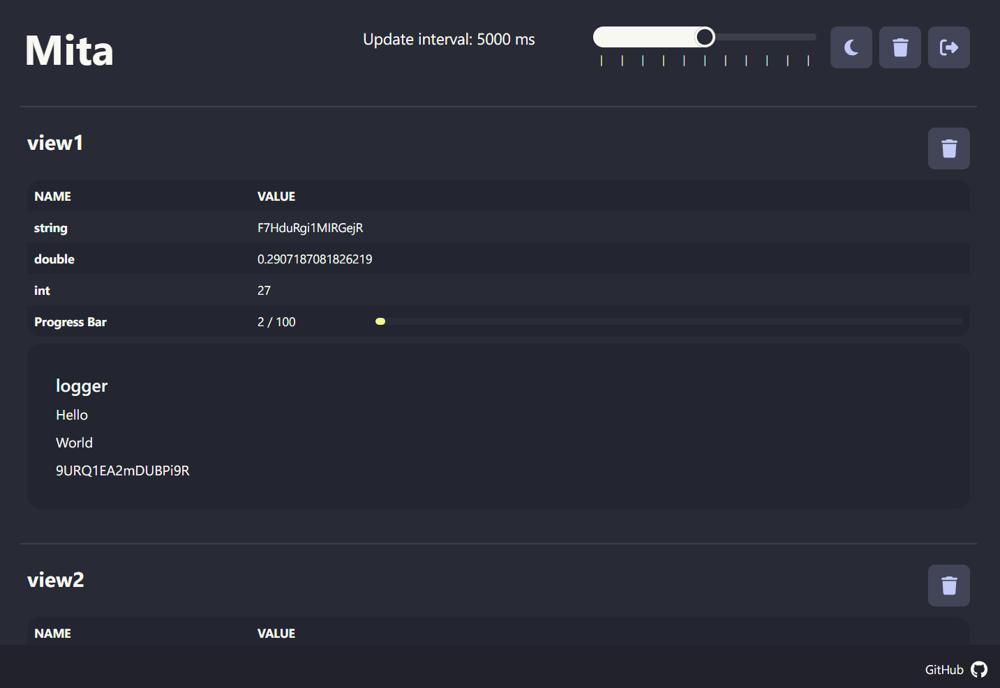

# Mita

Mita, named as Multi-Tangled, is a web application for monitoring runtime status and data of multiple machines 
(clients).

Demo: [https://mita-demo.controlnet.space](https://mita-demo.controlnet.space)



## Get Started

### Run Server

The server is used to accept client post data and host the web UI.

#### Docker
```bash
docker run \
  -p <PORT>:9000 \
  -e MITA_PASSWORD=<PASSWORD> \
  [-e MITA_GUEST_PASSWORD=<GUEST_PASSWORD>] \
  controlnet/mita[:<VERSION>]
```

#### Environment Variables

- `MITA_PASSWORD`: Password for **admin** accessing the api and web for read/write.
- `MITA_GUEST_PASSWORD`: Password for **guest** accessing the api and web for read only.
- `REACT_APP_PASSWORD`: _Optional_, set the default password for the frontend.
- `MITA_SECRET_KEY`: _Optional_, Server secret key for CRSF token.
- `MITA_TOKEN_SECRET`: _Optional_, Server secret key for JWT authentication token.

### Run Client

The client is the interface to post data to the server.

Now the python client is available. The other clients (nodejs, java, cli, ...) are in plan.

#### Python Client

Install the client from pypi:
```bash
pip install mita_client
```

Use the tqdm integrated client (require `tqdm` for progress bar):
```python
from mita_client import mita_tqdm
import time

for i in mita_tqdm(range(1000), ADDRESS, PASSWORD):
    time.sleep(0.1)
```

Use the fully client:
```python
from mita_client.client import Mita
from mita_client.component import *
from mita_client.view import View

# initialize components
view = View("python_view")
logger = Logger("python_logger")
line_chart = LineChart("python_line_chart")
progress_bar = ProgressBar("python_progress_bar", total=100)
var = Variable("python_var", 100)

# register components to view
view.add(
    var,
    progress_bar,
    logger,
    line_chart
)

# update data in the runtime, and post to the client
with Mita(ADDRESS, PASSWORD) as client:
    client.add(view)

    for i in range(10):
        logger.log(f"some msg {i}")
        line_chart.add(1 + i, 1 + i, "pos")
        line_chart.add(1 + i, 3.5 - i, "neg")
        progress_bar.set(i * 8 + 1)
        
        client.push()
```

## License

| Module | License                        |
|--------|--------------------------------|
| server | [AGPL](./LICENSE)              |
| client | [MIT](./client/python/LICENSE) |
